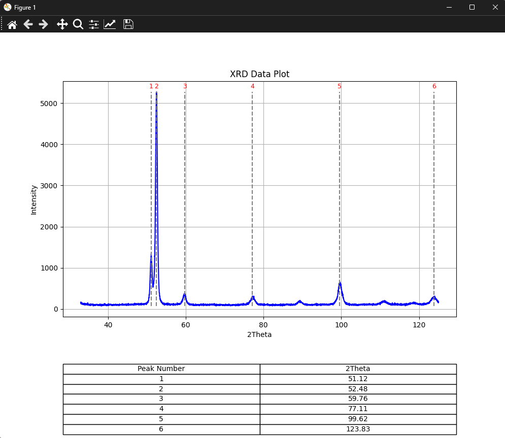

# XRD Data Processing and Peak Identification Tool

## Overview

The **XRD Data Processing and Peak Identification Tool** is an application designed for analyzing and processing data obtained from X-ray diffraction (XRD) experiments on metals. The primary purpose of the software is to identify peaks in XRD data and allow users to interactively adjust their positions, facilitating more accurate determination of the crystal structures and properties of the analyzed metal samples.

## Features

- **Interactive Peak Identification**: Enables users to manually adjust the positions of detected peaks in the XRD data using draggable lines on the plot.
- **Automatic Peak Detection**: Utilizes algorithms to automatically detect peaks in the XRD data based on intensity values and other configurable criteria.
- **Angle Determination**: Identifies the angles (2θ values) at which the peaks occur, which is essential for characterizing the crystal structure of the materials.
- **Data Visualization**: Generates plots of the XRD data with marked peaks and displays a table containing information about the peak positions.
- **XRD Data Handling**: Supports loading data from `.xy` or `.txt` files containing the results of XRD experiments.

## How It Works

1. **Loading XRD Data**: The application reads data from files containing 2θ (theta) angles and corresponding intensity values. These files typically come from XRD experiments.
2. **Automatic Peak Detection**: The software uses algorithms to detect peaks in the data by comparing the intensity values against a threshold and identifying points where the intensity surpasses this threshold.
3. **Interactive Adjustment**: Detected peaks can be interactively adjusted by the user. Draggable lines allow users to fine-tune the peak positions directly on the plot, ensuring precise identification of the angles where diffraction peaks occur.
4. **Angle Identification**: The application calculates the exact angles (2θ values) corresponding to the peaks, which are crucial for determining the crystal structure and phase composition of the sample.
5. **Result Visualization**: The results, including the identified peaks and their positions, are visualized on a plot with an overlaid table, allowing for an easy interpretation of the XRD data.

## GUI:
